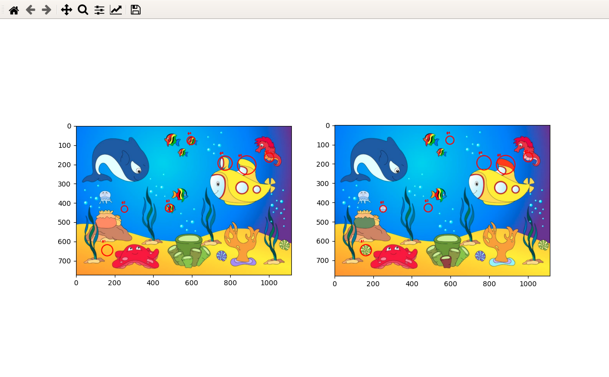
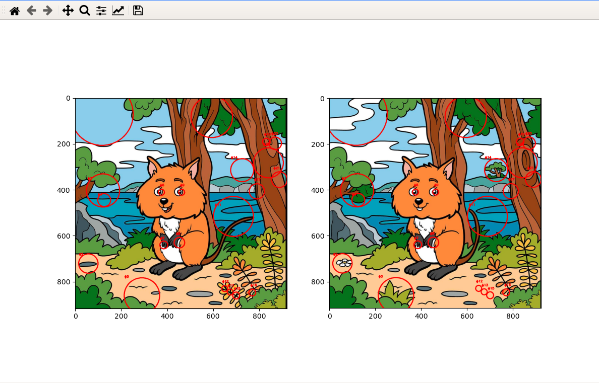
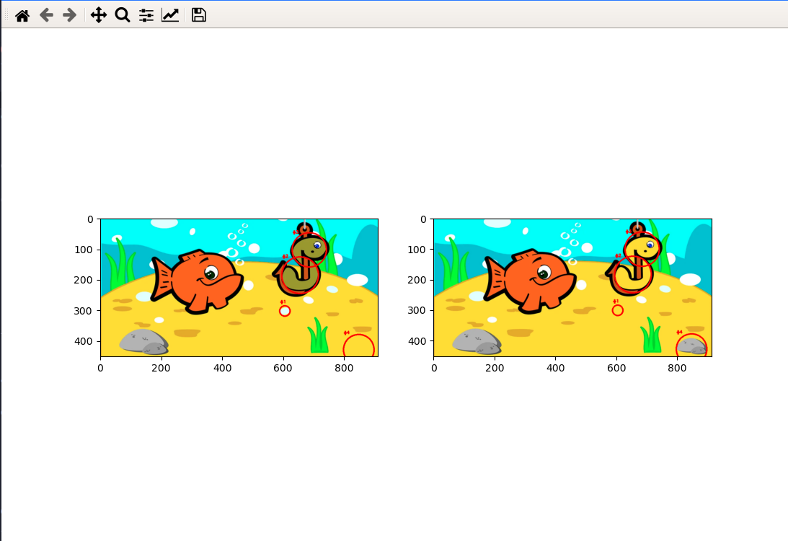

## Spot the differences. 

We all played this game in childhood. Well, I was very bad at it, so I though let's create a python script which will do that for me. 

Well, unfortunately the program is equally bad ;~; 

### Installation

 The modules it requires are:
 1. [Pillow](https://pypi.org/project/Pillow/): Imaging library
 2. [OpenCV2](https://opencv.org/)
 3. [Matplotlib](https://opencv.org/)
 4. Imutils
 5. Skimage
 6. Numpy
 
 You can install these modules manually or use this command

 ```bash
 $ pip3 install -r requirements.txt
 ```

### Usage

See help

```bash
$ python main.py -h

usage: main.py [-h] --img1 IMG1 --img2 IMG2

Will spot the differences between two images and circle them.

optional arguments:
  -h, --help   show this help message and exit
  --img1 IMG1  the path to image 1
  --img2 IMG2  the path to image 2
```

Pass the paths of the images as arguments

```bash
$ python3 main.py --img1 ./test1/img1.png --img2 ./test1/img2.png

```

It will open up a pyplot window which will show the differences by encircling them.

Something like this



And this





### How does it work

To Do..